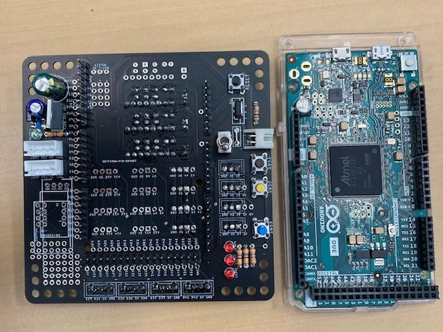
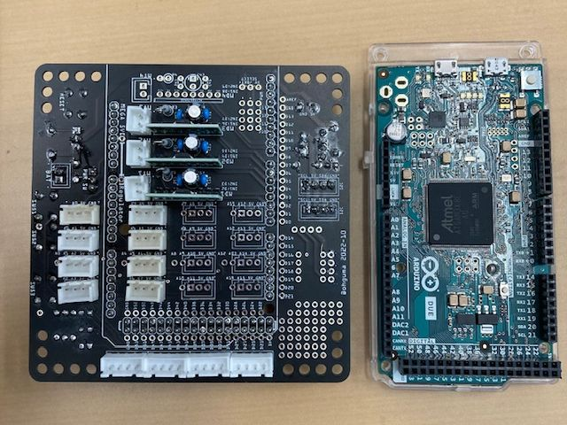
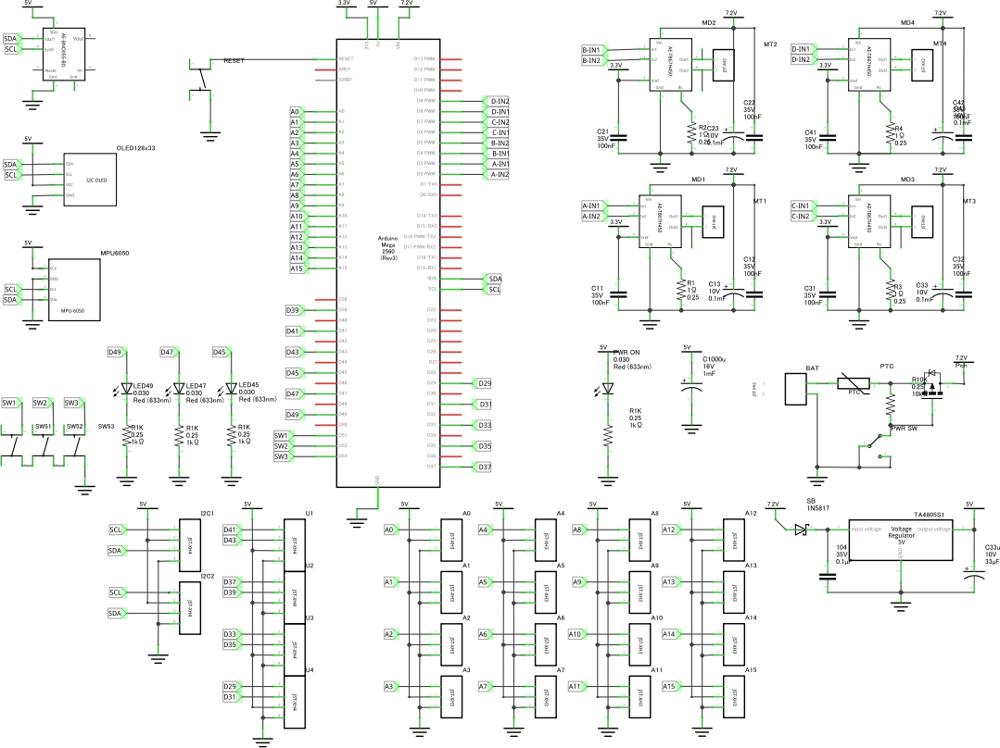
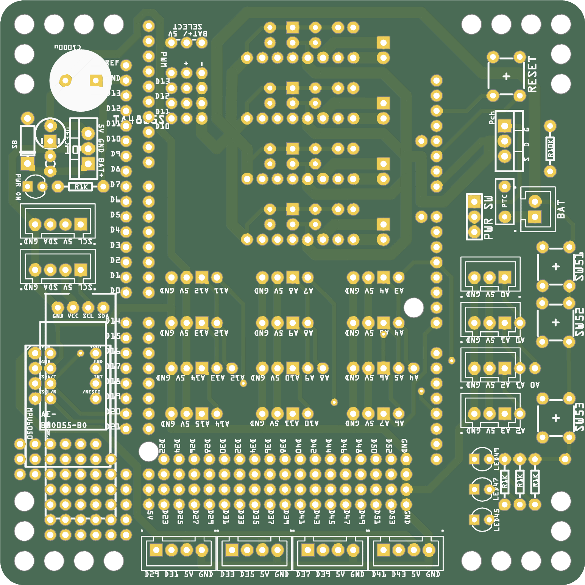
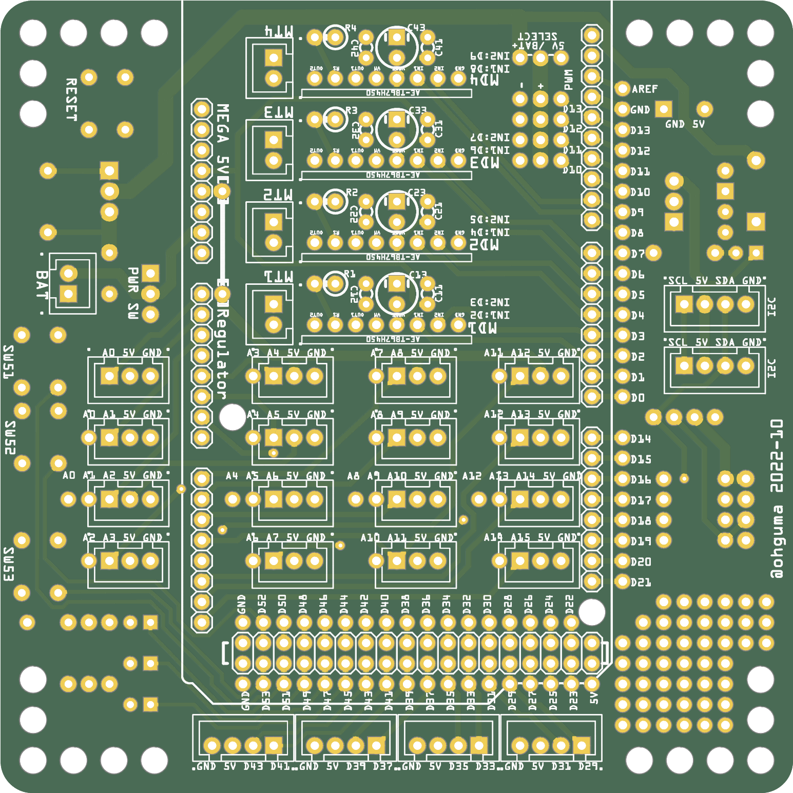

# Arduino Mega 拡張基板

## 概要

+ Arduino Mega のA0～15をXHコネクタで使うための基板。別途下記の利用も可能。
  + 基板サイズ　98 x 98mm
  + 4ピンXHで［D29,D31］［D33,D35］［D37,D39］［D41,D43］
  + 他のデジタルピンもビアから接続可能。
  + 3つのスイッチ（D51,D52,D53） INPUT_PULLUPで利用する。
  + 3つのLED（D45,D47,D49）　HIGHで点灯。
  + サーボ用端子（D10～13）　電源をバッテリー直結かレギュレータ経由か切り替え可能
  + モータードライバ[AE-TB67H450](https://akizukidenshi.com/catalog/g/gK-14753/)を最大４個搭載可能。
    + 1ch：D2,D3　2ch：D4,D5　3ch：D6,D7　4ch：D8,D9
  + 複数のI2C端子
    + TJ3B互換［SCL,5V,SDA,GND］を2ポート
    + MPU6050用
    + [AE-BNO055-BO](https://akizukidenshi.com/catalog/g/gK-16996)
    + OLED(128x32)
+ 各XHコネクタへの電源は、Mega 内蔵とは別のレギュレータから供給する。ジャンパ接続で内蔵5Vも利用可能。
+ レギュレータを3.3Vに変更することで Arduino Due でも利用可能。
----

## 実装

　

----
## パーツ

+ パーツは[秋月電子](https://akizukidenshi.com/catalog/)で概ね揃う。
+ 2023年1月21日時点、Due は[アスクル](https://www.askul.co.jp/p/KA08233/)が安い。（ピンヘッダなしが3,950円）

----
### パーツリスト

個数は明記なければ1個。

+ Arduino Mega2560 R3　もしくは　Arduino Due　もしくはそれらの互換機
+ ピンヘッダ
  - 1x8　5個
  - 1x10　10個
  - 2x18　18個
+ 入出力 
  - LED45,47,49用3mmLED
  - 上記LED用電流制限抵抗 1KΩ（茶黒赤金　Vf=2[V]3mA想定）
  - タクトスイッチ　制御用　3個
  - タクトスイッチ　リセット用　1個
  - （任意）[秋月　ＢＮＯ０５５使用　９軸センサーフュージョンモジュールキット AE-BNO055-BO](https://akizukidenshi.com/catalog/g/gK-16996)
  - （任意）ジャイロセンサMPU-6050
    - amazon などでMPU6050(GY-521)として売られているもの。
    - VCC,GND,SCL,SDAの4ピンを接続する。 
  - （任意）OLED 128x32 I2C
    - Adafruit SSD1306 ライブラリを利用する。

+ モータードライバ関係　最大4セット
  - [秋月　ＴＢ６７Ｈ４５０モータドライバモジュール AE-TB67H450](https://akizukidenshi.com/catalog/g/gK-14753/)
  - 金属皮膜抵抗 1W 0.2Ω
  - 電解コンデンサ 50V 100uF
  - セラミックコンデンサ 0.1uF (104）
  - セラミックコンデンサのみ1セット中2個、他は1個づつ
+ 電源関連 各1個
  - 基板用トグルスイッチ（下記FETのON/OFF用）
  - PchパワーMOSFET（30V40A MTP4835I3等）
  - 抵抗 10KΩ（茶黒橙金）
  - ポリスイッチ
+ センサ系電源まわり
  - ショットキーダイオード （４０V1A 1S4など。レギュレータへの逆接防止用）
  - ５Vレギュレータ（5V1A TA4805S等）　※Due使用時は3.3Vレギュレータ使用
  - セラミックコンデンサ 0.1uF (104）
  - 電解コンデンサ 50V 100uF
  - 電源ON表示用3mmLED
  - 上記LED用電流制限抵抗 1KΩ（茶黒赤金　Vf=2[V]想定で3mA）
  - 電解コンデンサ 10V 1000uF等

----
## 回路図

----
## 基板作成

+ [Fritzing](https://fritzing.org/)で設計し、基板作成まで行った。
  + 参考書　 「[Fritzing入門実習テキスト「Fritzing Basics」#マッハ新書 （ダウンロード商品）](https://booth.pm/ja/items/1414214)」の手順に従った。
+ 基板作成は「[JLCPCB](https://jlcpcb.com/)」。つや消し黒が安い。発注から1週間ほどで到着（運送便はUPS、支払いはpaypal）。
  + twitter https://twitter.com/JLCPCB_Japan
+ [発注時ガーバーファイル](./pcb/robot_arduino_mega202210_AE-TB67H450.zip)

 

----
2023-01-21 ohguma